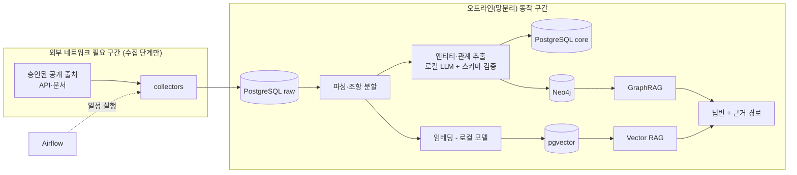

# 아키텍처

## 데이터 흐름

## 망분리 가정
- **외부 접속이 필요한 곳은 수집(collectors) 단계뿐**이다. 수집 결과는 PostgreSQL raw 스키마에 저장되며, 이후 파싱·추출·그래프 적재·임베딩·질의는 외부 API 없이 동작해야 한다.
- 임베딩 모델과 LLM은 `config/models.yaml`로 교체한다. 기본은 `provider: local`(GPU: RTX 4070)이고,
  `provider: api`는 `allow_external: true`를 명시해야만 로드된다(코드로 강제, `tests/test_config.py`).
- 실제 망분리 환경에서는 수집 서버와 질의 서버를 분리하고 raw 덤프를 반입하는 방식을 가정한다(Phase 7에서 절차 문서화).

## 서버 환경 전제 (Linux)
- WSL2 Ubuntu + Docker Compose. 저장소는 WSL 파일시스템 안(`~/`)에 둔다.
- 모든 포트는 `127.0.0.1`에만 바인딩한다(외부 노출 없음).
- 컨테이너는 `no-new-privileges`, 재시작 정책 `unless-stopped`, JSON 로그 로테이션(10MB × 5), 메모리 상한을 둔다.
- 데이터는 named volume, 백업 산출물은 `./backups`(git 제외)로 마운트한다.
- 앱 로그는 JSON 한 줄씩 stderr로 출력하고 docker 로그 드라이버가 수집·회전한다.

## 모듈 경계 (도메인 교체 가능성)
| 계층 | 위치 | 교체 시 바꾸는 것 |
|---|---|---|
| 출처 | `config/sources.yaml`, `collectors/` | 수집기와 승인 목록 |
| 스키마 | `migrations/` (raw/core) | 테이블 정의 |
| 온톨로지 | Phase 3에서 `ontology/` | 노드·관계 정의 |
| 모델 | `config/models.yaml` | provider·모델명 |

## 자원 계획 (RAM 8GB 가정)
PostgreSQL 1GB + Neo4j 1.5GB + Airflow 웹서버·스케줄러 각 1GB 상한 = 약 4.5GB. 로컬 LLM은 GPU VRAM에 올리지만
모델 로딩 시 시스템 RAM도 쓰므로 동시 구동 시 여유가 작다. 문제가 생기면 Airflow를 profile로 분리해 필요할 때만 켠다.
